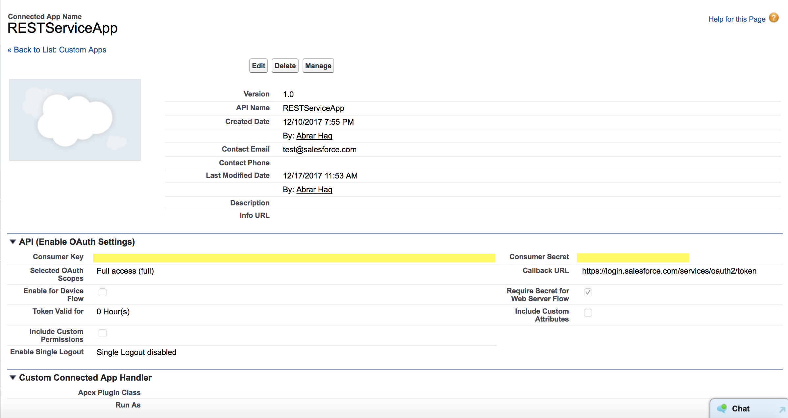

# Salesforce Custom Apex REST WebService (@RestResource annotation)

## Salesforce Trailhead
<a href="https://trailhead.salesforce.com/en/modules/apex_integration_services/units/apex_integration_webservices" target="_blank" alt="Apex Web Services">Apex Web Services</a> 

Here you will find the following details about Salesforce custom Apex REST Webservice.

<ol type="1">
<li>What does REST stand for?</li>
<li>How to create and expose an Apex REST Webservice?</li>
<li>Apex REST Webservice Annotations, Actions and Details</li>
<li>Considerations</li>
<li>Connected Apps</li>
<li>How to create a Connected App</li>
<li>How to Test Custom Apex REST API?</li>
<li>Test (@isTest) class for Custom Apex REST API</li>
<li>Useful Resources</li>
</ol>

## What does REST stand for?

<ol type="1">
<li>REST stands for Representational State Transfer.</li>
<li>It returns response in <b>"JSON", "XML", "Custom"</b> format.</li>
</ol>

## How to create and expose an Apex REST Webservice?
<ol type="1">
<li>You can expose your Apex classes and methods by annotating your class with <b>"@RestResource(urlMapping='/yourUrl')"</b> annotation so that external applications can access your code and your application through the REST architecture.</li>
<li>An Apex class must be declared with access modifier <b>"global"</b>.</li>
<li>An Apex class method must be declared with access modifier <b>"global static"</b>.</li>
<li>Apex class methods must be annotated with one of the following annotations:
<ul>
<li>@HttpGet</li>
<li>@HttpPost</li>
<li>@HttpPatch</li>
<li>@HttpPut</li>
<li>@HttpDelete</li>
</ul>
</li>
<li>Invoking a custom Apex REST Web service method always uses system context.</li>
<li>Consequently, the current user's credentials are not used, and any user who has access to these methods can use their full power, regardless of permissions, field-level security, or sharing rules.</li>
<li>Apex class methods that are exposed through the Apex REST API don't enforce object permissions and field-level security by default.</li>
<li>Also, sharing rules (record-level access) are enforced only when declaring a class with the with sharing keyword. This requirement applies to all Apex classes, including to classes that are exposed through Apex REST API. To enforce sharing rules for Apex REST API methods, declare the class that contains these methods with the <b>"with sharing"</b> keyword.</li>
<li>A single Apex class annotated with @RestResource can't have multiple methods annotated with the same HTTP request method. For example, the same class can't have two methods annotated with @HttpGet.</li>
<li>Methods annotated with @HttpGet or @HttpDelete should have no parameters. This is because GET and DELETE requests have no request body, so there's nothing to deserialize.</li>
<li>The base endpoint should always be: <b>https://yoursalesforceinstance.salesforce.com/services/apexrest/</b></li>
<li>The full endpoint will be for Managed and Unmanaged packages:

<ul>
<li>Managed Package (if the "urlMapping" is "/MyRestResource/*") = https://instance.salesforce.com/services/apexrest/packageNamespace/MyRestResource/</li>
<li>Unmanaged Pacakge (if the "urlMapping" is "/Account/*") = https://yoursalesforceinstance.salesforce.com/services/apexrest/Account/</li>
</ul>

</li>
<li>The URL mapping is case-sensitive and can contain a wildcard character (*).</li>
</ol>

## Apex REST Webservice Annotations, Actions and Details
<table>
	<tr>
		<th colspan="3">Apex REST Annotations, associated Actions and Details</th>
	</tr>
	<tr>
		<th>Annotation</th>
		<th>Action</th>
		<th>Details</th>
	</tr>
	<tr>
		<td>@HttpGet</td>
		<td>Read</td>
		<td>Reads or retrieves records.</td>
	</tr>
	<tr>
		<td>@HttpPost</td>
		<td>Create</td>
		<td>Creates records.</td>
	</tr>
	<tr>
		<td>@HttpPatch</td>
		<td>Update</td>
		<td>Typically used to update fields in existing records.</td>
	</tr>
	<tr>
		<td>@HttpPut</td>
		<td>Upsert</td>
		<td>Typically used to update existing records or create records.</td>
	</tr>
	<tr>
		<td>@HttpDelete</td>
		<td>Delete</td>
		<td>Deletes records.</td>
	</tr>
</table>

## Considerations
<ol type="1">
<li>Apex REST currently doesn't support requests of Content-Type multipart/form-data.</li>
<li>If you need to specify a null value for one of your parameters in your request data, you can either omit the parameter entirely or specify a null value. In JSON, you can specify null as the value. In XML, you must use the http://www.w3.org/2001/XMLSchema-instance namespace with a nil value.</li>
<li>For request data in either JSON or XML, valid values for Boolean parameters are: true, false (both of these are treated as case-insensitive), 1 and 0 (the numeric values, not strings of “1” or “0”). Any other values for Boolean parameters result in an error.</li>
<li>Calls to Apex REST classes count against the organization's API governor limits.</li>
<li>All standard Apex governor limits apply to Apex REST classes.</li>
</ol>

## Connected Apps
A <a href="https://help.salesforce.com/articleView?id=connected_app_overview.htm" target="_blank" alt="connected app">connected app</a> integrates an application with Salesforce using APIs. Connected apps use standard SAML and OAuth protocols to authenticate, provide single sign-on, and provide tokens for use with Salesforce APIs. In addition to standard OAuth capabilities, connected apps allow Salesforce admins to set various security policies and have explicit control over who can use the corresponding apps.

Salesforce uses the OAuth protocol to allow users of applications to securely access data without having to reveal username and password credentials. Supported <a href="https://developer.salesforce.com/docs/atlas.en-us.api_rest.meta/api_rest/intro_understanding_authentication.htm" target="_blank" alt="OAuth flows">OAuth flows</a> include:
<ol type="1">
<li><b>Web server flow</b>, where the server can securely protect the consumer secret.</li>
<li><b>User-agent flow</b>, used by applications that cannot securely store the consumer secret.</li>
<li><b>Username-password flow</b>, where the application has direct access to user credentials.</li>
</ol>

## How to create a Connected App
To create a connected app:
<ol type="1">
<li>Go to <b>Setup > App Setup > Create > Apps > in "Connected Apps" section > click New</b></li>
<li></li>
<li></li>
<li></li>
</ol>

## How to Test Custom Apex REST API?

## Test (@isTest) class for Custom Apex REST API

## Useful Resources
<ol type="a">
<li>https://trailhead.salesforce.com/en/modules/apex_integration_services/units/apex_integration_webservices</li>
<li>https://developer.salesforce.com/docs/atlas.en-us.apexcode.meta/apexcode/apex_rest.htm</li>
<li>https://developer.salesforce.com/docs/atlas.en-us.apexcode.meta/apexcode/apex_methods_system_restcontext.htm#apex_methods_system_restcontext</li>
<li>https://developer.salesforce.com/docs/atlas.en-us.apexcode.meta/apexcode/apex_methods_system_restrequest.htm#apex_methods_system_restrequest</li>
<li>https://developer.salesforce.com/docs/atlas.en-us.apexcode.meta/apexcode/apex_methods_system_restresponse.htm#apex_methods_system_restresponse</li>
<li>https://help.salesforce.com/articleView?id=connected_app_overview.htm</li>
<li>https://developer.salesforce.com/docs/atlas.en-us.api_rest.meta/api_rest/intro_understanding_authentication.htm</li>
<li>https://developer.salesforce.com/page/Creating_REST_APIs_using_Apex_REST</li>
</ol>
